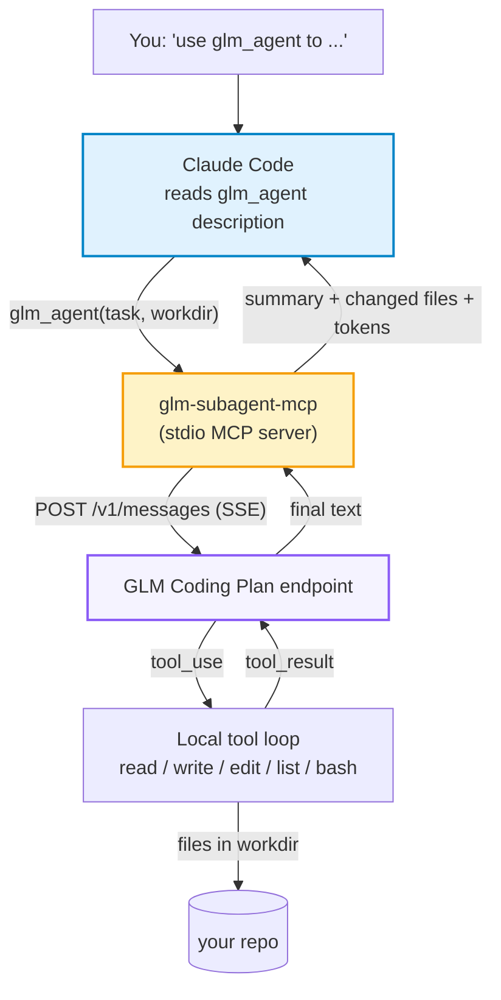

<a id="top"></a>

<div align="center">
  <h1>glm-subagent-mcp</h1>
</div>

<div align="center">

[](LICENSE)
[](https://nodejs.org/)
[](https://modelcontextprotocol.io/)
[](#%EF%B8%8F-how-it-works)
[](https://docs.z.ai/devpack/overview)

**Call GLM as a Claude Code sub-agent from a plain prompt, and spend GLM tokens instead of Claude tokens.**

**English** | [简体中文](README.zh-CN.md)

[How It Works](#%EF%B8%8F-how-it-works) | [Quick Start](#-quick-start) | [Configuration](#%EF%B8%8F-configuration) | [Safety](#-safety-boundaries) | [Acknowledgements](#-acknowledgements)

</div>

---

glm-subagent-mcp lets you tell Claude Code, in an ordinary prompt, to hand a task to GLM. It is an MCP server with one tool, `glm_agent(task, workdir)`. GLM runs its own read / write / edit / list / bash loop inside `workdir`, then returns a summary, the changed files, and token usage.

The token saving comes from where the work happens. Reading files, writing code, running commands and retrying all happen on the GLM side and use your GLM Coding Plan quota. Claude's context receives only the short summary, so a long task costs Claude a few hundred tokens instead of the whole working transcript.

## 👀 Overview

### ✨ Highlights

<table>
<tr>
<td align="center" width="25%">💬<br/><b>Prompt-triggered</b><br/><sub>Say "use glm_agent" and Claude delegates the task</sub></td>
<td align="center" width="25%">💸<br/><b>Work stays on GLM</b><br/><sub>File reads, edits and command output never enter Claude's context</sub></td>
<td align="center" width="25%">🔌<br/><b>Coding Plan endpoint</b><br/><sub>Anthropic Messages API, <code>glm-5.3</code> by default</sub></td>
<td align="center" width="25%">🔒<br/><b>Path sandbox</b><br/><sub>File tools stay inside <code>workdir</code>, symlinks included</sub></td>
</tr>
</table>

### 📢 News

- **2026-10-07** 🎉 Initial version: single-tool server, mock end-to-end test. Not yet verified against the real Z.ai endpoint.

## 🛠️ How It Works



1. You ask Claude to use `glm_agent` for a task. Claude calls it with a complete task description and an absolute `workdir`.
2. The server sends the task to GLM. Each `tool_use` reply is executed locally and sent back, until GLM stops or the iteration cap (default 30) is reached.
3. Claude receives the summary, the list of changed files, and input/output token counts.

### 🧰 The tool

| Argument  | Required | Meaning                                                        |
| :-------- | :------: | :------------------------------------------------------------- |
| `task`    |    ✅    | Self-contained task. GLM does not see the Claude conversation. |
| `workdir` |    ✅    | Absolute path of the directory GLM works in.                   |
| `context` |          | Extra background or constraints.                               |
| `model`   |          | `glm-5.3` (default) or `glm-5.3-flash`.                        |

GLM's own tools: `read_file`, `write_file`, `edit_file`, `list_dir`, `run_bash`.

## 📁 Project Structure

```text
glm-subagent-mcp/
├── src/
│   ├── index.js        # MCP server, registers glm_agent
│   ├── glmAgent.js     # tool loop + workdir sandbox
│   └── glmClient.js    # streaming client, retry, stall timeout, cancel
├── test/run.mjs        # end-to-end test against a mock SSE server
├── package.json
└── LICENSE
```

## 🚀 Quick Start

### 1. Install

```bash
git clone https://github.com/HOWILLMAKEIT/glm-subagent-mcp.git
cd glm-subagent-mcp
npm install
```

### 2. Register with Claude Code

```bash
claude mcp add glm -s user -e GLM_API_KEY=YOUR_CODING_PLAN_KEY -- node /absolute/path/to/glm-subagent-mcp/src/index.js
```

### 3. Use it in a prompt

Restart Claude Code, then name the tool in your request:

```text
Use glm_agent to add unit tests for utils.py in this repo, then summarize what changed.
```

```text
Delegate the README translation to GLM with glm_agent. Work in /path/to/project.
```

Tasks that suit GLM are well specified and self-contained: scaffolding, tests, translation, docs, local refactors. For tasks that need the whole conversation as context, keep them on Claude.

### 4. Test (no key needed)

```bash
npm test
```

The test starts a mock Anthropic-style SSE server and checks the full loop: file write, path escape, symlink escape, bash.

## ⚙️ Configuration

Pass these with `-e` when registering.

| Variable                    | Default                          | Meaning                                                                                                   |
| :-------------------------- | :------------------------------- | :-------------------------------------------------------------------------------------------------------- |
| `GLM_API_KEY`               | none                             | Coding Plan API key                                                                                       |
| `GLM_BASE_URL`              | `https://api.z.ai/api/anthropic` | Coding Plan Anthropic Messages endpoint. Mainland-China accounts: `https://open.bigmodel.cn/api/anthropic` |
| `GLM_MODEL`                 | `glm-5.3`                        | Coding Plan models: `glm-5.3`, `glm-5.3-flash`                                                            |
| `GLM_MAX_TOKENS`            | `32768`                          | Per-turn output cap (this project's value, not an official limit)                                         |
| `GLM_AGENT_MAX_ITERS`       | `30`                             | Max tool-loop turns                                                                                       |
| `GLM_AGENT_BASH_TIMEOUT_MS` | `120000`                         | Per-command bash timeout                                                                                  |
| `GLM_MAX_CONCURRENT`        | `1`                              | In-flight requests to GLM                                                                                 |
| `GLM_STALL_TIMEOUT_MS`      | `120000`                         | Idle time on the stream before a retry                                                                    |

Z.ai warns that choosing the wrong endpoint prevents Coding Plan quota from being used ([docs](https://docs.z.ai/devpack/tool/others.md), accessed 2026-10-07).

## 🔒 Safety Boundaries

- `read_file`, `write_file`, `edit_file`, `list_dir` reject any path outside `workdir`, after resolving symlinks.
- `run_bash` starts in `workdir`, but the command itself is **not** sandboxed. GLM can run any shell command. Use it only on directories you are fine letting it modify.
- Requests go to Z.ai servers. Do not delegate secret or regulated code.
- The Z.ai FAQ states the Coding Plan is limited to officially supported tools and products ([FAQ](https://docs.z.ai/devpack/faq.md), accessed 2026-10-07). Whether calling it from your own MCP server is allowed is for you to confirm.

## 🙏 Acknowledgements

Thanks to [djerok/glm-mcp](https://github.com/djerok/glm-mcp) (MIT). This project started from its GLM client and agent loop.

<p align="right"><a href="#top">🔝Back to top</a></p>
