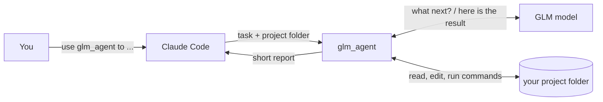

<a id="top"></a>

<div align="center">
  <h1>glm-subagent-mcp</h1>
</div>

<div align="center">

[](LICENSE)
[](https://nodejs.org/)
[](https://modelcontextprotocol.io/)
[](#-how-it-works)
[](https://docs.z.ai/devpack/overview)

**With this MCP server, Claude Code can call a GLM model as a sub-agent.**

**English** | [简体中文](README.zh-CN.md)

[What It Does](#-what-it-does) | [Quick Start](#-quick-start) | [How It Works](#-how-it-works) | [Settings](#-settings) | [Safety](#-safety) | [Acknowledgements](#-acknowledgements)

</div>

---

## 💡 What It Does

A stdio MCP server that exposes one tool, `glm_agent(task, workdir, context?, model?)`. Each call runs an agent loop against GLM's Anthropic-compatible `/v1/messages` endpoint. The model emits `tool_use` blocks for `read_file`, `write_file`, `edit_file`, `list_dir` and `run_bash`. The server executes them inside `workdir` and feeds back `tool_result` until the model stops. The caller receives the final text, the changed file paths and token usage.

The intermediate tool traffic never enters the calling model's context, and the tokens are billed to the Coding Plan. GLM sees only `task` and `context`, not the Claude conversation.

Name the tool in a prompt to delegate:

```text
Use glm_agent to add unit tests for utils.py in this repo, then summarize what changed.
```

Fits self-contained tasks with a clear spec: scaffolding, tests, translation, docs, local refactors.

## 🚀 Quick Start

You need Claude Code, Node.js 18 or newer, and an API key from a GLM Coding Plan.

**1. Download and install**

```bash
git clone https://github.com/HOWILLMAKEIT/glm-subagent-mcp.git
cd glm-subagent-mcp
npm install
```

**2. Add it to Claude Code**

```bash
claude mcp add glm -s user -e GLM_API_KEY=YOUR_KEY -- node /absolute/path/to/glm-subagent-mcp/src/index.js
```

If your Coding Plan account is on the mainland-China site (bigmodel.cn), add one more setting. The default address is the international one:

```bash
claude mcp add glm -s user -e GLM_API_KEY=YOUR_KEY -e GLM_BASE_URL=https://open.bigmodel.cn/api/anthropic -- node /absolute/path/to/glm-subagent-mcp/src/index.js
```

**3. Restart Claude Code and ask for it by name**

```text
Delegate the README translation to GLM with glm_agent. Work in /path/to/project.
```

To check the setup without a key, run `npm test`. It runs the whole flow against a fake GLM server on your machine.

## 🔍 How It Works



1. Claude Code calls `glm_agent` over MCP stdio. While it runs, the server sends progress notifications (iteration, output tokens, tok/s). Cancelling the call aborts the in-flight request.
2. The server POSTs to `{GLM_BASE_URL}/v1/messages` with `stream: true` and the five tool definitions. On `tool_use` it runs the tool locally and appends the `tool_result`. The loop ends when the model answers without a tool call, at `GLM_AGENT_MAX_ITERS` (30), or on cancel.
3. Requests retry with exponential backoff on 429, 5xx and concurrency errors (up to 4 retries). A stream with no bytes for `GLM_STALL_TIMEOUT_MS` is aborted and retried. One request is in flight at a time.
4. The result is a header (model, status, iterations, directory), token counts, changed files and GLM's final text, truncated at 50,000 characters.

`changed files` is recorded from `write_file` and `edit_file` only. Files modified through `run_bash` are not tracked.

### Tool options

| Option    | Required | Meaning                                                               |
| :-------- | :------: | :-------------------------------------------------------------------- |
| `task`    |    ✅    | What GLM should do. Write it in full, since GLM cannot see your chat. |
| `workdir` |    ✅    | Absolute path of the folder GLM works in.                             |
| `context` |          | Extra background or constraints.                                      |
| `model`   |          | `glm-5.3` (default) or `glm-5.3-flash`.                               |

GLM has five actions inside that folder: read a file, write a file, edit a file, list a directory, and run a shell command.

## 📋 Settings

Pass settings with `-e NAME=value` when you run `claude mcp add`.

| Setting        | Default                          | Meaning                                                                                                    |
| :------------- | :------------------------------- | :--------------------------------------------------------------------------------------------------------- |
| `GLM_API_KEY`  | none                             | Your Coding Plan API key. Required.                                                                        |
| `GLM_BASE_URL` | `https://api.z.ai/api/anthropic` | Coding Plan address. Mainland-China accounts: `https://open.bigmodel.cn/api/anthropic`                     |
| `GLM_MODEL`    | `glm-5.3`                        | Model to use. The Coding Plan supports `glm-5.3` and `glm-5.3-flash`.                                      |

Z.ai warns that using the wrong address means your Coding Plan quota is not used ([docs](https://docs.z.ai/devpack/tool/others.md), accessed 2026-10-07).

<details>
<summary>Advanced settings</summary>

| Setting                     | Default  | Meaning                                                             |
| :-------------------------- | :------- | :------------------------------------------------------------------ |
| `GLM_AGENT_MAX_ITERS`       | `30`     | Maximum rounds per task                                             |
| `GLM_AGENT_BASH_TIMEOUT_MS` | `120000` | Time limit for one shell command                                    |
| `GLM_MAX_TOKENS`            | `32768`  | Output limit per round (this project's choice, not an official cap) |
| `GLM_MAX_CONCURRENT`        | `1`      | Requests sent to GLM at the same time                               |
| `GLM_STALL_TIMEOUT_MS`      | `120000` | How long to wait in silence before retrying                         |
| `GLM_MAX_RETRIES`           | `4`      | Retries on 429, 5xx and concurrency errors                          |

</details>

## 🔒 Safety

- File actions only work inside the folder you pass as `workdir`. Paths outside it are refused, including paths that reach outside through symbolic links.
- Shell commands start in `workdir` but are **not** restricted. GLM can run any command, so use this on folders you are fine letting it change.
- Your code is sent to Z.ai's servers. Keep secrets and regulated code on your own machine.
- Z.ai's FAQ says the Coding Plan is limited to officially supported tools and products ([FAQ](https://docs.z.ai/devpack/faq.md), accessed 2026-10-07). Whether a self-made plug-in like this one is allowed is for you to confirm.

## 📢 Status

Tested end to end against a fake GLM server, and once against the mainland-China Coding Plan address (open.bigmodel.cn) with `glm-5.3`. The international z.ai address has not been tested.

## 🙏 Acknowledgements

Thanks to [djerok/glm-mcp](https://github.com/djerok/glm-mcp) (MIT). This project started from its GLM client and agent loop.

<p align="right"><a href="#top">🔝Back to top</a></p>
