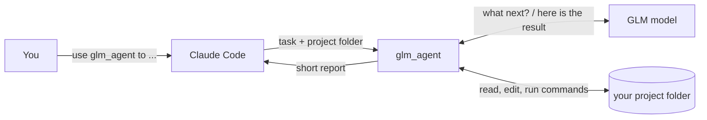

<a id="top"></a>

<div align="center">
  <h1>glm-subagent-mcp</h1>
</div>

<div align="center">

[](LICENSE)
[](https://nodejs.org/)
[](https://modelcontextprotocol.io/)
[](#-how-it-works)
[](https://docs.z.ai/devpack/overview)

**With this MCP server, Claude Code can call a GLM model as a sub-agent.**

**English** | [简体中文](README.zh-CN.md)

[What It Does](#-what-it-does) | [Quick Start](#-quick-start) | [How It Works](#-how-it-works) | [Settings](#-settings) | [Safety](#-safety) | [Acknowledgements](#-acknowledgements)

</div>

---

## 💡 What It Does

Sub-agents in Claude Code are configured with Claude models, so everything a sub-agent reads or runs is billed as Claude tokens. glm-subagent-mcp provides the same delegation pattern backed by a GLM model: one MCP tool, `glm_agent`, that carries a bounded coding task to completion on GLM and returns only the outcome.

Each call is a *delegated run* with three parts:

- **Input.** `task`, `workdir`, and optionally `context` and `model`. GLM sees these and nothing else from the Claude conversation.
- **Execution.** GLM works in `workdir` through five actions (read, write and edit a file, list a directory, run a shell command), driven in a loop against its Anthropic-compatible `/v1/messages` endpoint.
- **Output.** The final text, the changed file paths, and token usage. The intermediate tool traffic stays on the GLM side, so it is billed to the Coding Plan and kept out of Claude's context.

Name the tool in a prompt to start a run:

```text
Use glm_agent to add unit tests for utils.py in this repo, then summarize what changed.
```

Delegated runs fit tasks with a clear specification that do not depend on earlier conversation: scaffolding, tests, translation, docs, local refactors.

## 🚀 Quick Start

You need Claude Code, Node.js 18 or newer, and an API key from a GLM Coding Plan.

**1. Download and install**

```bash
git clone https://github.com/HOWILLMAKEIT/glm-subagent-mcp.git
cd glm-subagent-mcp
npm install
```

**2. Add it to Claude Code**

```bash
claude mcp add glm -s user -e GLM_API_KEY=YOUR_KEY -- node /absolute/path/to/glm-subagent-mcp/src/index.js
```

If your Coding Plan account is on the mainland-China site (bigmodel.cn), add one more setting. The default address is the international one:

```bash
claude mcp add glm -s user -e GLM_API_KEY=YOUR_KEY -e GLM_BASE_URL=https://open.bigmodel.cn/api/anthropic -- node /absolute/path/to/glm-subagent-mcp/src/index.js
```

**3. Restart Claude Code and ask for it by name**

```text
Delegate the README translation to GLM with glm_agent. Work in /path/to/project.
```

To check the setup without a key, run `npm test`. It runs the whole flow against a fake GLM server on your machine.

## 🔍 How It Works



A delegated run proceeds in three steps:

1. Claude Code calls `glm_agent` over MCP stdio.
2. The server POSTs to `{GLM_BASE_URL}/v1/messages` with `stream: true` and the five tool definitions. Each `tool_use` block is executed locally and its `tool_result` is appended to the messages. The loop ends when the model replies without a tool call, at `GLM_AGENT_MAX_ITERS` (30), or on cancel.
3. The server returns a header (model, status, iterations, directory), token counts, the changed files and GLM's final text, truncated at 50,000 characters.

Long runs and unreliable networks are handled by these mechanisms:

| Concern                | Mechanism                                                                                   |
| :--------------------- | :------------------------------------------------------------------------------------------ |
| Long-running calls     | Progress notifications (iteration, output tokens, tok/s); cancelling aborts the in-flight request |
| Transient API errors   | Exponential backoff on 429, 5xx and concurrency errors, up to `GLM_MAX_RETRIES` (4)         |
| Stalled streams        | A stream silent for `GLM_STALL_TIMEOUT_MS` is aborted and retried                           |
| Concurrency limits     | One request in flight at a time (`GLM_MAX_CONCURRENT`)                                      |
| Filesystem scope       | File actions are confined to `workdir` (see Safety)                                         |

`changed files` is recorded from the write and edit actions only. Files modified through the shell action are not tracked.

### Tool options

| Option    | Required | Meaning                                                               |
| :-------- | :------: | :-------------------------------------------------------------------- |
| `task`    |    ✅    | What GLM should do. Write it in full, since GLM cannot see your chat. |
| `workdir` |    ✅    | Absolute path of the folder GLM works in.                             |
| `context` |          | Extra background or constraints.                                      |
| `model`   |          | `glm-5.3` (default) or `glm-5.3-flash`.                               |

GLM has five actions inside that folder: read a file, write a file, edit a file, list a directory, and run a shell command.

## 📋 Settings

Pass settings with `-e NAME=value` when you run `claude mcp add`.

| Setting        | Default                          | Meaning                                                                                                    |
| :------------- | :------------------------------- | :--------------------------------------------------------------------------------------------------------- |
| `GLM_API_KEY`  | none                             | Your Coding Plan API key. Required.                                                                        |
| `GLM_BASE_URL` | `https://api.z.ai/api/anthropic` | Coding Plan address. Mainland-China accounts: `https://open.bigmodel.cn/api/anthropic`                     |
| `GLM_MODEL`    | `glm-5.3`                        | Model to use. The Coding Plan supports `glm-5.3` and `glm-5.3-flash`.                                      |

Z.ai warns that using the wrong address means your Coding Plan quota is not used ([docs](https://docs.z.ai/devpack/tool/others.md), accessed 2026-10-07).

<details>
<summary>Advanced settings</summary>

| Setting                     | Default  | Meaning                                                             |
| :-------------------------- | :------- | :------------------------------------------------------------------ |
| `GLM_AGENT_MAX_ITERS`       | `30`     | Maximum rounds per task                                             |
| `GLM_AGENT_BASH_TIMEOUT_MS` | `120000` | Time limit for one shell command                                    |
| `GLM_MAX_TOKENS`            | `32768`  | Output limit per round (this project's choice, not an official cap) |
| `GLM_MAX_CONCURRENT`        | `1`      | Requests sent to GLM at the same time                               |
| `GLM_STALL_TIMEOUT_MS`      | `120000` | How long to wait in silence before retrying                         |
| `GLM_MAX_RETRIES`           | `4`      | Retries on 429, 5xx and concurrency errors                          |

</details>

## 🔒 Safety

- **File actions** are confined to `workdir`. Paths outside it are refused, including paths that reach outside through symbolic links.
- **Shell actions** start in `workdir` and run with your user's privileges, so their reach is that of your account. Use delegated runs on folders you are comfortable letting GLM modify.
- **Data flow.** Task text, file contents and command output are sent to Z.ai's servers. Keep secrets and regulated code on your machine.
- **Plan terms.** Z.ai's FAQ limits the Coding Plan to officially supported tools and products ([FAQ](https://docs.z.ai/devpack/faq.md), accessed 2026-10-07). Whether a self-built MCP server falls inside that scope is for you to confirm.

## 📢 Status

Verified: the full loop against a mock server (`npm test`), and one live run on the mainland-China Coding Plan address (open.bigmodel.cn) with `glm-5.3`. Not yet tested: the international address (api.z.ai).

## 🙏 Acknowledgements

Thanks to [djerok/glm-mcp](https://github.com/djerok/glm-mcp) (MIT). This project started from its GLM client and agent loop.

<p align="right"><a href="#top">🔝Back to top</a></p>
