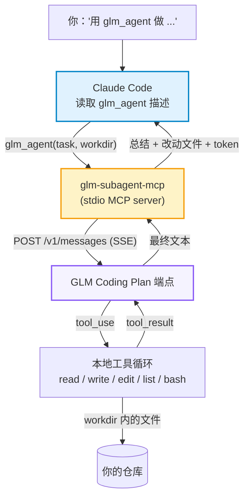

<a id="top"></a>

<div align="center">
  <h1>glm-subagent-mcp</h1>
</div>

<div align="center">

---

glm-subagent-mcp 让你在普通的 prompt 里直接告诉 Claude Code：把这个任务交给 GLM。它是一个只有 `glm_agent(task, workdir)` 一个工具的 MCP server。GLM 在 `workdir` 内用自己的 read / write / edit / list / bash 工具循环干活，最后返回总结、改动文件和 token 用量。

省 token 的原因在于活在哪里干。读文件、写代码、跑命令、失败重试都发生在 GLM 一侧，消耗的是你的 GLM Coding Plan 额度。Claude 的上下文里只会收到一段简短总结，所以一个很长的任务对 Claude 来说只占几百 token，而不是整段工作记录。

## 👀 概览

### ✨ 亮点

<table>
<tr>
<td align="center" width="25%">💬<br/><b>Prompt 触发</b><br/><sub>说一句“用 glm_agent”，Claude 就会委派任务</sub></td>
<td align="center" width="25%">💸<br/><b>活留在 GLM 一侧</b><br/><sub>读文件、改文件和命令输出都不进入 Claude 的上下文</sub></td>
<td align="center" width="25%">🔌<br/><b>Coding Plan 端点</b><br/><sub>Anthropic Messages API，默认 <code>glm-5.3</code></sub></td>
<td align="center" width="25%">🔒<br/><b>路径沙箱</b><br/><sub>文件工具限制在 <code>workdir</code> 内，含符号链接</sub></td>
</tr>
</table>

### 📢 动态

- **2026-10-07** 🎉 初始版本：单工具 server，附模拟端点的端到端测试。已用国内 Coding Plan 端点（open.bigmodel.cn）和 glm-5.3 实测通过一次；国际站 z.ai 端点未测试。

## 🛠️ 工作原理



1. 你让 Claude 用 `glm_agent` 做某个任务，Claude 带着完整的任务描述和绝对路径 `workdir` 调用它。
2. server 把任务发给 GLM。每次返回 `tool_use`，就在本机执行并把结果回传，直到 GLM 停止或达到轮数上限（默认 30）。
3. Claude 收到总结、改动文件列表和输入/输出 token 数。

### 🧰 工具参数

| 参数        | 必填 | 含义                                      |
| :---------- | :--: | :---------------------------------------- |
| `task`    |  ✅  | 自包含的任务。GLM 看不到 Claude 的对话。  |
| `workdir` |  ✅  | GLM 工作目录的绝对路径。                  |
| `context` |      | 额外背景或约束。                          |
| `model`   |      | `glm-5.3`（默认）或 `glm-5.3-flash`。 |

GLM 自己的工具：`read_file`、`write_file`、`edit_file`、`list_dir`、`run_bash`。

## 📁 项目结构

```text
glm-subagent-mcp/
├── src/
│   ├── index.js        # MCP server，注册 glm_agent
│   ├── glmAgent.js     # 工具循环 + workdir 沙箱
│   └── glmClient.js    # 流式客户端、重试、空闲超时、取消
├── test/run.mjs        # 对模拟 SSE 服务器的端到端测试
├── package.json
└── LICENSE
```

## 🚀 快速开始

### 1. 安装

```bash
git clone https://github.com/HOWILLMAKEIT/glm-subagent-mcp.git
cd glm-subagent-mcp
npm install
```

### 2. 注册到 Claude Code

```bash
claude mcp add glm -s user -e GLM_API_KEY=你的CodingPlan密钥 -- node /绝对路径/glm-subagent-mcp/src/index.js
```

### 3. 在 prompt 里使用

重启 Claude Code，然后在请求里点名这个工具：

```text
用 glm_agent 给本仓库的 utils.py 补单元测试，完成后总结改了什么。
```

```text
把 README 的翻译交给 GLM，用 glm_agent，工作目录是 /path/to/project。
```

适合交给 GLM 的任务是说明清楚、自包含的那类：搭脚手架、写测试、翻译、写文档、局部重构。需要整段对话作为上下文的任务，留给 Claude 自己做。

### 4. 测试（不需要 key）

```bash
npm test
```

测试会启动一个模拟 Anthropic 风格 SSE 的服务器，检查完整流程：写文件、路径越界、符号链接越界、bash。

## ⚙️ 配置

注册时用 `-e` 传入。

| 变量                          | 默认值                             | 含义                                                                                         |
| :---------------------------- | :--------------------------------- | :------------------------------------------------------------------------------------------- |
| `GLM_API_KEY`               | 无                                 | Coding Plan 的 API key                                                                       |
| `GLM_BASE_URL`              | `https://api.z.ai/api/anthropic` | Coding Plan 的 Anthropic Messages 端点。国内账号用`https://open.bigmodel.cn/api/anthropic` |
| `GLM_MODEL`                 | `glm-5.3`                        | Coding Plan 支持`glm-5.3`、`glm-5.3-flash`                                               |
| `GLM_MAX_TOKENS`            | `32768`                          | 每轮输出上限（本项目取值，不是官方上限）                                                     |
| `GLM_AGENT_MAX_ITERS`       | `30`                             | 工具循环最大轮数                                                                             |
| `GLM_AGENT_BASH_TIMEOUT_MS` | `120000`                         | 单条 bash 超时                                                                               |
| `GLM_MAX_CONCURRENT`        | `1`                              | 同时发往 GLM 的请求数                                                                        |
| `GLM_STALL_TIMEOUT_MS`      | `120000`                         | 流式响应空闲多久后重试                                                                       |

Z.ai 提示：端点选错会导致用不上 Coding Plan 的额度（[文档](https://docs.z.ai/devpack/tool/others.md)，访问于 2026-10-07）。

## 🔒 安全边界

- `read_file`、`write_file`、`edit_file`、`list_dir` 会拒绝 `workdir` 之外的路径，符号链接解析后同样检查。
- `run_bash` 从 `workdir` 启动，但命令本身**不受**沙箱限制，GLM 可以执行任何 shell 命令。只对可以放心让它修改的目录使用。
- 请求发往 Z.ai 服务器，机密或受监管的代码不要委派。
- Z.ai 的 FAQ 写明 Coding Plan 仅限在官方支持的工具和产品内使用（[FAQ](https://docs.z.ai/devpack/faq.md)，访问于 2026-10-07）。自建 MCP server 调用是否在允许范围内，需要你自行确认。

## 🙏 致谢

感谢 [djerok/glm-mcp](https://github.com/djerok/glm-mcp)（MIT）。本项目从它的 GLM 客户端和 agent 循环起步。

<p align="right"><a href="#top">🔝回到顶部</a></p>
