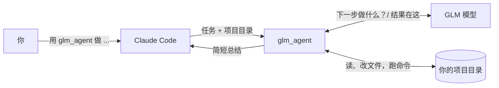

<a id="top"></a>

<div align="center">
  <h1>glm-subagent-mcp</h1>
</div>

<div align="center">

[](LICENSE)
[](https://nodejs.org/)
[](https://modelcontextprotocol.io/)
[](#-工作原理)
[](https://docs.z.ai/devpack/overview)

**把 GLM 接成 Claude Code 的 sub-agent：在 prompt 里点名即可委派，token 记在 GLM 账上。**

[English](README.md) | **简体中文**

[它做什么](#-它做什么) | [快速开始](#-快速开始) | [工作原理](#-工作原理) | [配置](#-配置) | [安全](#-安全) | [致谢](#-致谢)

</div>

---

## 💡 它做什么

Claude Code 读的每个文件、跑的每条命令都会消耗 Claude 的 token。这个项目给 Claude Code 加了一个工具 `glm_agent`。你让 Claude 用它时，Claude 会把任务交给 GLM 模型。GLM 自己读文件、改文件、跑命令，最后回报一小段总结。Claude 只看得到这段总结。

比如你输入：

```text
用 glm_agent 给本仓库的 utils.py 补单元测试，完成后总结改了什么。
```

Claude 把任务和项目目录交给 GLM。GLM 做完后，Claude 收到几行内容：改了什么、涉及哪些文件、用了多少 token。中间的读文件、写代码、跑测试，都记在你的 GLM Coding Plan 上。

适合交给 GLM 的任务说得清、能独立完成：搭脚手架、写测试、翻译、写文档、小范围重构。依赖整段对话的任务更适合留给 Claude，因为 GLM 看不到你们的对话。
## 🚀 快速开始

需要 Claude Code、Node.js 18 或更高版本，以及一个 GLM Coding Plan 的 API key。

**1. 下载并安装**

```bash
git clone https://github.com/HOWILLMAKEIT/glm-subagent-mcp.git
cd glm-subagent-mcp
npm install
```

**2. 添加到 Claude Code**

```bash
claude mcp add glm -s user -e GLM_API_KEY=你的KEY -- node /绝对路径/glm-subagent-mcp/src/index.js
```

如果你的 Coding Plan 账号在国内站（bigmodel.cn），要多加一项设置。默认地址是国际站：

```bash
claude mcp add glm -s user -e GLM_API_KEY=你的KEY -e GLM_BASE_URL=https://open.bigmodel.cn/api/anthropic -- node /绝对路径/glm-subagent-mcp/src/index.js
```

**3. 重启 Claude Code，点名让它用**

```text
把 README 的翻译交给 GLM，用 glm_agent，工作目录是 /path/to/project。
```

不想用真 key 检查安装是否正常，可以运行 `npm test`。它会在本机用一个假的 GLM 服务器把整个流程跑一遍。

## 🔍 工作原理



1. Claude 带着任务和项目目录的绝对路径调用 `glm_agent`。
2. `glm_agent` 问 GLM 下一步做什么。GLM 回答一个动作，比如“读这个文件”或“跑这条命令”。`glm_agent` 在你的目录里执行，再把结果告诉 GLM。这样来回，直到 GLM 说完成，或者达到 30 轮。
3. Claude 收到 GLM 的总结、改动的文件列表和 token 用量。

### 工具参数

| 参数      | 必填 | 含义                                                    |
| :-------- | :--: | :------------------------------------------------------ |
| `task`    |  ✅  | 要 GLM 做的事。要写完整，因为 GLM 看不到你们的对话。    |
| `workdir` |  ✅  | GLM 工作目录的绝对路径。                                |
| `context` |      | 额外的背景或约束。                                      |
| `model`   |      | `glm-5.3`（默认）或 `glm-5.3-flash`。                   |

GLM 在这个目录里有五个动作：读文件、写文件、改文件、列目录、跑 shell 命令。

## 📋 配置

运行 `claude mcp add` 时，用 `-e 名称=值` 传入。

| 配置           | 默认值                           | 含义                                                                      |
| :------------- | :------------------------------- | :------------------------------------------------------------------------ |
| `GLM_API_KEY`  | 无                               | Coding Plan 的 API key，必填。                                            |
| `GLM_BASE_URL` | `https://api.z.ai/api/anthropic` | Coding Plan 地址。国内账号用 `https://open.bigmodel.cn/api/anthropic`     |
| `GLM_MODEL`    | `glm-5.3`                        | 使用的模型。Coding Plan 支持 `glm-5.3` 和 `glm-5.3-flash`。               |

Z.ai 提示：地址用错，Coding Plan 的额度就用不上（[文档](https://docs.z.ai/devpack/tool/others.md)，访问于 2026-10-07）。

<details>
<summary>高级配置</summary>

| 配置                        | 默认值   | 含义                                           |
| :-------------------------- | :------- | :--------------------------------------------- |
| `GLM_AGENT_MAX_ITERS`       | `30`     | 每个任务最多几轮                               |
| `GLM_AGENT_BASH_TIMEOUT_MS` | `120000` | 单条 shell 命令的时间上限                      |
| `GLM_MAX_TOKENS`            | `32768`  | 每轮输出上限（本项目取值，不是官方上限）       |
| `GLM_MAX_CONCURRENT`        | `1`      | 同时发给 GLM 的请求数                          |
| `GLM_STALL_TIMEOUT_MS`      | `120000` | 连续多久没有响应就重试                         |

</details>

## 🔒 安全

- 文件操作只在你传入的 `workdir` 内生效。目录之外的路径会被拒绝，通过符号链接绕出去的也一样。
- shell 命令从 `workdir` 启动，但**不受**限制。GLM 可以执行任何命令，所以只对你放心让它改动的目录使用。
- 你的代码会发到 Z.ai 的服务器。机密或受监管的代码留在本机。
- Z.ai 的 FAQ 写明 Coding Plan 仅限在官方支持的工具和产品内使用（[FAQ](https://docs.z.ai/devpack/faq.md)，访问于 2026-10-07）。像这样自己写的插件是否在允许范围内，需要你自行确认。

## 📢 状态

已用假的 GLM 服务器完整测试过，也用国内 Coding Plan 地址（open.bigmodel.cn）和 `glm-5.3` 实测通过一次。国际站 z.ai 地址没有测试过。

## 🙏 致谢

感谢 [djerok/glm-mcp](https://github.com/djerok/glm-mcp)（MIT）。本项目从它的 GLM 客户端和 agent 循环起步。

<p align="right"><a href="#top">🔝回到顶部</a></p>
