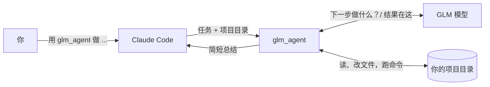

<a id="top"></a>

<div align="center">
  <h1>glm-subagent-mcp</h1>
</div>

<div align="center">

[](LICENSE)
[](https://nodejs.org/)
[](https://modelcontextprotocol.io/)
[](#-工作原理)
[](https://docs.z.ai/devpack/overview)

**利用本 MCP，可以在 Claude Code 中调用 GLM 的模型作为 subagent。**

[English](README.md) | **简体中文**

[它做什么](#-它做什么) | [快速开始](#-快速开始) | [工作原理](#-工作原理) | [配置](#-配置) | [安全](#-安全) | [致谢](#-致谢)

</div>

---

## 💡 它做什么

Claude Code 的 sub-agent 配置的是 Claude 模型，所以 sub-agent 读到的、跑出的一切都按 Claude token 计费。本项目用 GLM 模型提供同样的委派方式：一个 MCP 工具 `glm_agent`，把范围明确的编码任务在 GLM 上做完，只把结果交回来。

每次调用是一次*委派运行*，由三部分组成：

- **输入。** `task`、`workdir`，以及可选的 `context` 和 `model`。GLM 只能看到这些，看不到 Claude 的对话。
- **执行。** GLM 在 `workdir` 内通过五个动作工作（读、写、改文件，列目录，执行 shell 命令），以循环方式驱动它的 Anthropic 兼容端点 `/v1/messages`。
- **输出。** 最终文本、改动的文件路径和 token 用量。中间的工具交互留在 GLM 一侧，因此记在 Coding Plan 上，也不占用 Claude 的上下文。

在 prompt 里点名这个工具即可发起一次运行：

```text
用 glm_agent 给本仓库的 utils.py 补单元测试，完成后总结改了什么。
```

委派运行适合需求明确、不依赖之前对话的任务：搭脚手架、写测试、翻译、写文档、局部重构。

## 🚀 快速开始

需要 Claude Code、Node.js 18 或更高版本，以及一个 GLM Coding Plan 的 API key。

**1. 下载并安装**

```bash
git clone https://github.com/HOWILLMAKEIT/glm-subagent-mcp.git
cd glm-subagent-mcp
npm install
```

**2. 添加到 Claude Code**

```bash
claude mcp add glm -s user -e GLM_API_KEY=你的KEY -- node /绝对路径/glm-subagent-mcp/src/index.js
```

如果你的 Coding Plan 账号在国内站（bigmodel.cn），要多加一项设置。默认地址是国际站：

```bash
claude mcp add glm -s user -e GLM_API_KEY=你的KEY -e GLM_BASE_URL=https://open.bigmodel.cn/api/anthropic -- node /绝对路径/glm-subagent-mcp/src/index.js
```

**3. 重启 Claude Code，点名让它用**

```text
把 README 的翻译交给 GLM，用 glm_agent，工作目录是 /path/to/project。
```

不想用真 key 检查安装是否正常，可以运行 `npm test`。它会在本机用一个假的 GLM 服务器把整个流程跑一遍。

## 🔍 工作原理



一次委派运行分三步：

1. Claude Code 通过 MCP stdio 调用 `glm_agent`。
2. server 向 `{GLM_BASE_URL}/v1/messages` 发起 `stream: true` 的请求，附带五个工具的定义。每个 `tool_use` 在本机执行，其 `tool_result` 追加进消息。模型不再调用工具、达到 `GLM_AGENT_MAX_ITERS`（30）或被取消时，循环结束。
3. server 返回头部（模型、状态、轮次、目录）、token 数、改动的文件和 GLM 的最终文本，超过 50,000 字符会截断。

长时间运行和不稳定的网络由下面几项机制处理：

| 问题           | 机制                                                                              |
| :------------- | :-------------------------------------------------------------------------------- |
| 调用耗时长     | 推送进度通知（轮次、输出 token、tok/s）；取消调用会中止在途请求                   |
| 接口偶发错误   | 遇到 429、5xx 和并发超限时指数退避，最多 `GLM_MAX_RETRIES`（4）次                 |
| 流式响应卡住   | 连续 `GLM_STALL_TIMEOUT_MS` 没有数据就中止并重试                                  |
| 并发限制       | 同一时刻只有一个请求在途（`GLM_MAX_CONCURRENT`）                                  |
| 文件系统范围   | 文件动作限制在 `workdir` 内（见“安全”）                                           |

`changed files` 只来自写文件和改文件动作，通过 shell 动作修改的文件不会被统计。

### 工具参数

| 参数      | 必填 | 含义                                                    |
| :-------- | :--: | :------------------------------------------------------ |
| `task`    |  ✅  | 要 GLM 做的事。要写完整，因为 GLM 看不到你们的对话。    |
| `workdir` |  ✅  | GLM 工作目录的绝对路径。                                |
| `context` |      | 额外的背景或约束。                                      |
| `model`   |      | `glm-5.3`（默认）或 `glm-5.3-flash`。                   |

GLM 在这个目录里有五个动作：读文件、写文件、改文件、列目录、跑 shell 命令。

## 📋 配置

运行 `claude mcp add` 时，用 `-e 名称=值` 传入。

| 配置           | 默认值                           | 含义                                                                      |
| :------------- | :------------------------------- | :------------------------------------------------------------------------ |
| `GLM_API_KEY`  | 无                               | Coding Plan 的 API key，必填。                                            |
| `GLM_BASE_URL` | `https://api.z.ai/api/anthropic` | Coding Plan 地址。国内账号用 `https://open.bigmodel.cn/api/anthropic`     |
| `GLM_MODEL`    | `glm-5.3`                        | 使用的模型。Coding Plan 支持 `glm-5.3` 和 `glm-5.3-flash`。               |

Z.ai 提示：地址用错，Coding Plan 的额度就用不上（[文档](https://docs.z.ai/devpack/tool/others.md)，访问于 2026-10-07）。

<details>
<summary>高级配置</summary>

| 配置                        | 默认值   | 含义                                           |
| :-------------------------- | :------- | :--------------------------------------------- |
| `GLM_AGENT_MAX_ITERS`       | `30`     | 每个任务最多几轮                               |
| `GLM_AGENT_BASH_TIMEOUT_MS` | `120000` | 单条 shell 命令的时间上限                      |
| `GLM_MAX_TOKENS`            | `32768`  | 每轮输出上限（本项目取值，不是官方上限）       |
| `GLM_MAX_CONCURRENT`        | `1`      | 同时发给 GLM 的请求数                          |
| `GLM_STALL_TIMEOUT_MS`      | `120000` | 连续多久没有响应就重试                         |
| `GLM_MAX_RETRIES`           | `4`      | 遇到 429、5xx、并发超限时的重试次数            |

</details>

## 🔒 安全

- **文件动作**限制在 `workdir` 内。目录之外的路径会被拒绝，通过符号链接绕出去的也一样。
- **shell 动作**从 `workdir` 启动，权限等同于你当前的用户账号，所以影响范围就是你账号能触及的范围。请只对你放心让 GLM 修改的目录发起委派运行。
- **数据流向。** 任务文本、文件内容和命令输出会发送到 Z.ai 的服务器。机密或受监管的代码留在本机。
- **套餐条款。** Z.ai 的 FAQ 把 Coding Plan 限定在官方支持的工具和产品内使用（[FAQ](https://docs.z.ai/devpack/faq.md)，访问于 2026-10-07）。自建 MCP server 是否在该范围内，需要你自行确认。

## 📢 状态

已验证：对模拟服务器跑通完整循环（`npm test`），以及在国内 Coding Plan 地址（open.bigmodel.cn）上用 `glm-5.3` 实测一次。尚未测试：国际站地址（api.z.ai）。

## 🙏 致谢

感谢 [djerok/glm-mcp](https://github.com/djerok/glm-mcp)（MIT）。本项目从它的 GLM 客户端和 agent 循环起步。

<p align="right"><a href="#top">🔝回到顶部</a></p>
